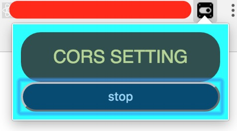

# chrome add-ons CORS
##### Cross-origin resource sharin add-ons of chrome

## development
```
$ npm install
$ webpack
$ tsc
```
#### then you can import the CORS add-ons project to the chrome 
* click the start button to enable CORS

* click the stop button to disable CORS



## License
MIT License
